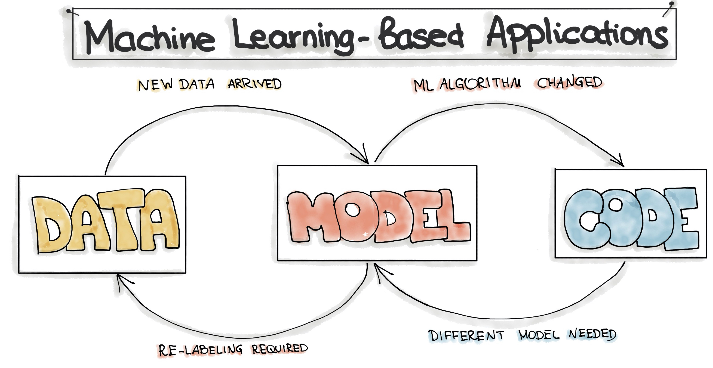

# Learn MLOps

## The idea

**MLOps = Machine Learning + DevOps.** It builds automated systems that train, validate, deploy, monitor, and replace ML models.

Calling `model.predict(...)` is only model deployment. MLOps is the repeatable system around that model.

> code + data → train → test → deploy → monitor → retrain

## Why it differs from DevOps

Software behaviour mainly changes when its code changes. ML behaviour can also change because training data, features, parameters, or the real world changes.

That means an ML system must track **code, data, model, and metrics**—not code alone.

## The six stages

| Stage | Simple meaning |
| --- | --- |
| Data | Collect and validate data. |
| Train | Create model candidates. |
| Select | Keep the model that meets the quality goal. |
| Deploy | Make the approved model available. |
| Monitor | Watch data drift, quality, errors, and latency. |
| Retrain | Safely replace the model when evidence says to. |

## When you need MLOps

Use MLOps when models are improved, retrained, or checked regularly in production. A one-off model served by a normal application often only needs normal DevOps.

## Learn in this order

1. Run the small project in [../working/README.md](../working/README.md).
2. Explain each stage without notes.
3. Add experiment tracking (MLflow).
4. Add data versioning (DVC).
5. Add CI, monitoring, and retraining.
