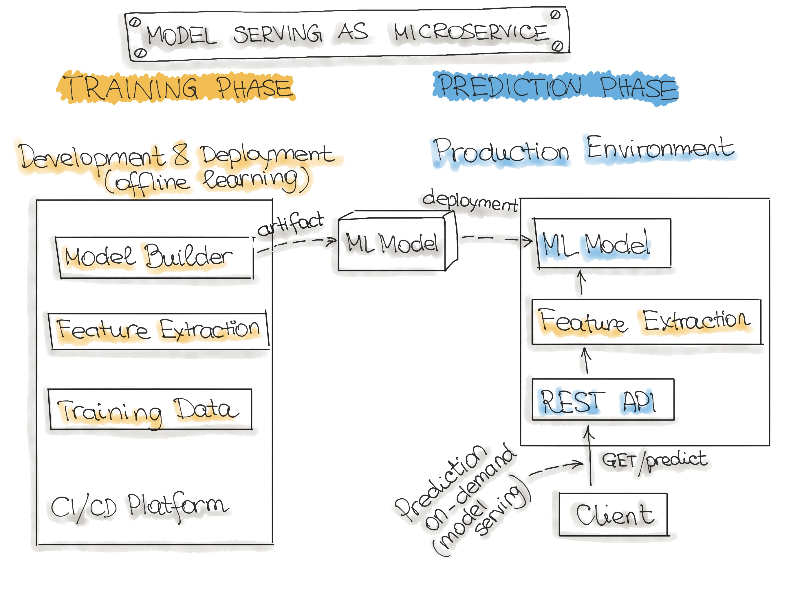

# Work with the starter project

This Iris classifier is the smallest practical loop: **train → test → API → Docker**.

## Project files

```text
src/train.py      trains the model and saves it
src/api.py        provides /health and /predict
tests/test_api.py checks the trained model can predict
Dockerfile        packages the API
```

## 1. Set up Python

```bash
python3 -m venv .venv
source .venv/bin/activate
pip install -r requirements.txt
```

## 2. Train the model

```bash
python -m src.train
```

This creates `models/model.joblib` and `metrics.json`.

## 3. Run the check

```bash
pytest
```

## 4. Start the API

```bash
uvicorn src.api:app --reload
```

Open <http://127.0.0.1:8000/docs> to try the API.

## 5. Ask for a prediction

```bash
curl -X POST http://127.0.0.1:8000/predict \
  -H 'Content-Type: application/json' \
  -d '{"sepal_length": 5.1, "sepal_width": 3.5, "petal_length": 1.4, "petal_width": 0.2}'
```

## 6. Run it with Docker

Train first, then run:

```bash
docker build -t iris-mlops .
docker run --rm -p 8000:8000 iris-mlops
```

In another terminal:

```bash
curl http://127.0.0.1:8000/health
```



## Done when

- Training prints an accuracy score.
- `pytest` passes.
- `/health` returns `model_loaded: true`.
- `/predict` returns a class number.
